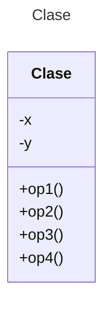

# Proyecto (Maven) - Biblioteca PoP

Proyecto a aplicación *Patttern of Patterns* 
(Strategy, Observador, Singleton, Decorador, Iterator, Adaptador, Factory Method)

## Instrucciones

Diseña una solución para el siguiente problema del dominio de bibliotecas. La solución debería utilizar los patrones indicados. Construye el Diagrama de clases e implementa el mismo en un lenguaje orientado a objetos.

# Problema

El **Centro de Información** del **Instituto Tecnológico de Culiacán** desea implementar un sistema de información para el control de préstamos y devoluciones de su catálogo de libros. Los usuarios que solicitan libros son de 3 tipos: 1) Profesores 2) Estudiantes y 3) Publico en general. El catálogo de biblioteca incluye la siguiente información para cada libro: ISBN, Titulo, Autor,  Editorial, Existencia y Estado (Nuevo, Hasta 2 años de uso, Con más de 2 años de uso). Dependiendo del tipo de usuario se maneja una política de préstamo distinta:

* Si es un Profesor, el orden de préstamo es: *Nuevo, Hasta 2 años de uso,  Con más de 2 años de uso*.
* Si es un Alumno, el orden de préstamo es: *Hasta 2 años de uso, Nuevo y Con más de 2 años de uso*.
* Si es público en general, el orden de préstamo es: *Con más de 2 años de uso, Hasta 2 años de uso y nuevo*.

Para cada usuario se almacena la siguiente información: ```Clave```, ```Nombre```, ```Apellido Paterno```, ```Apellido Materno``` y ```Tipo``` (*Profesor*, *Estudiante* y *Público en General*). Los usuarios pueden cambiar de ```Tipo```, pero mantienen su ```Clave```: un *Estudiante* puede pasar a ser *Profesor* (pero no a la inversa), un *Profesor* o un *Estudiante* pueden pasar a ser *Público General* (pero no a la inversa), el *Público en General* puede pasar a ser *Profesor* o *Estudiante*.

Al Jefe de biblioteca le interesa tener siempre ejemplares en existencia, de tal manera que cuando el número de ejemplares de cualquier tipo es 2, desea que el sistema le registre (automáticamente) el título correspondiente para solicitar a la casa editorial correspondiente que le resurta 5 ejemplares del título. Los títulos a resurtir serán almacenados en memoria o en disco -en un archivo de texto (plano)- dependiendo de la configuración del sistema. Para implementar esta funcionalidad considere el diseño de un objeto [Data Access Object (DAO)](http://www.corej2eepatterns.com/DataAccessObject.htm) cuyo propósito es realizar el mapeo Objeto-Memoria u Objeto-Registro dependiendo de la configuración.

Construya una pequeña aplicación para demostrar el funcionamiento de su solución.

**HINT**: Puede crear un menú con las siguientes opciones:

1. Inicializar el sistema (inicializa la "base de datos" con datos ficticios)
2. Mostrar la base de datos (Muestra la información de la base de datos).
3. Prestar libros
4. Devolver libros
5. Cambiar de tipo de usuario
6. Mostrar títulos a resurtir
7. Configurar sistema ("títulos a surtir" Memoria/Disco)
8. Salir 

## Diagrama de clases
[Editor en línea](https://mermaid.live/)

[Referencia-Mermaid](https://mermaid.js.org/syntax/classDiagram.html)

## Diagrama de clases UML con draw.io
El repositorio está configurado para crear Diagramas de clases UML con ```draw.io```. Para usarlo simplemente agrega un archivo con extensión ```.drawio.png```, das doble clic sobre el mismo y se activará el editor ```draw.io``` incrustado en ```VSCode``` para edición. Asegúrate de agregar las formas UML en el menú de formas del lado izquierdo (opción ```+Más formas```).

## Uso del proyecto con Maven

### Compilar
```
mvn -f app compile
```
### Probar N tests
```
mvn -f app test
```
### Probar 1 test
```
mvn -f app test -Dtest="AppTest#shouldAnswerWithTrue" 
```
### Ejecutar App
```
java -cp app/target/classes miPrincipal.App
```
### Empacar App
```
mvn -f app package
```
### Limpiar binarios
```
mvn -f app clean
```
## Comandos Git-Cambios y envío a Autograding

### Por cada cambio importante que haga, actualice su historia usando los comandos:
```
git add .
git commit -m "Descripción del cambio"
```
### Envíe sus actualizaciones a GitHub para Autograding con el comando:
```
git push origin main
```
